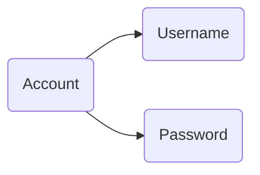

# DTube Intro - Proof of Concept

## map

## glossary

### password

| YouTube | DTube |
| ---------- | ----------- |
| Explanation | Explanation with link to [username](#username) |

Go to [map](#map)

### username

| YouTube | DTube |
| ---------- | ----------- |
| Explanation | Explanation with link to [password](#password) |

Go to [map](#map)

